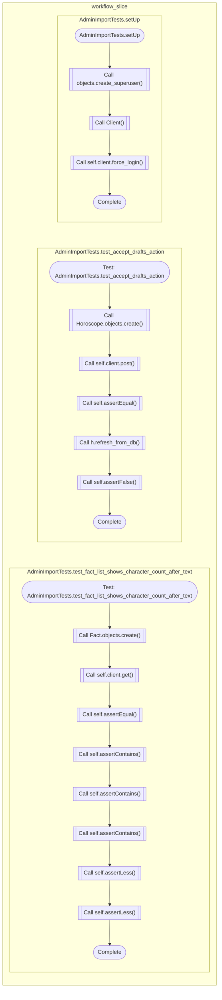

# CodeDebrief Mermaid Snapshot

Source: `snapshot-flow-b181978b2f8a9949-flow-efb29abe7c7c4ddb-04c079a0780181f9`
Diagram hash: `04c079a0780181f9`

```mermaid
flowchart TD
  subgraph workflow_slice["workflow_slice"]
    direction TB
    subgraph mflow_flow_b181978b2f8a9949["AdminImportTests.setUp"]
      direction TB
      mflow_b181978b2f8a9949_n1(["AdminImportTests.setUp"])
      mflow_b181978b2f8a9949_n2[["Call objects.create_superuser()"]]
      mflow_b181978b2f8a9949_n3[["Call Client()"]]
      mflow_b181978b2f8a9949_n4[["Call self.client.force_login()"]]
      mflow_b181978b2f8a9949_n5(["Complete"])
      mflow_b181978b2f8a9949_n1 --> mflow_b181978b2f8a9949_n2
      mflow_b181978b2f8a9949_n2 --> mflow_b181978b2f8a9949_n3
      mflow_b181978b2f8a9949_n3 --> mflow_b181978b2f8a9949_n4
      mflow_b181978b2f8a9949_n4 --> mflow_b181978b2f8a9949_n5
    end
    subgraph mflow_flow_efb29abe7c7c4ddb["AdminImportTests.test_accept_drafts_action"]
      direction TB
      mflow_efb29abe7c7c4ddb_n1(["Test: AdminImportTests.test_accept_drafts_action"])
      mflow_efb29abe7c7c4ddb_n2[["Call Horoscope.objects.create()"]]
      mflow_efb29abe7c7c4ddb_n3[["Call self.client.post()"]]
      mflow_efb29abe7c7c4ddb_n4[["Call self.assertEqual()"]]
      mflow_efb29abe7c7c4ddb_n5[["Call h.refresh_from_db()"]]
      mflow_efb29abe7c7c4ddb_n6[["Call self.assertFalse()"]]
      mflow_efb29abe7c7c4ddb_n7(["Complete"])
      mflow_efb29abe7c7c4ddb_n1 --> mflow_efb29abe7c7c4ddb_n2
      mflow_efb29abe7c7c4ddb_n2 --> mflow_efb29abe7c7c4ddb_n3
      mflow_efb29abe7c7c4ddb_n3 --> mflow_efb29abe7c7c4ddb_n4
      mflow_efb29abe7c7c4ddb_n4 --> mflow_efb29abe7c7c4ddb_n5
      mflow_efb29abe7c7c4ddb_n5 --> mflow_efb29abe7c7c4ddb_n6
      mflow_efb29abe7c7c4ddb_n6 --> mflow_efb29abe7c7c4ddb_n7
    end
    subgraph mflow_flow_3341e3e1bcf044d2["AdminImportTests.test_fact_list_shows_character_count_after_text"]
      direction TB
      mflow_3341e3e1bcf044d2_n1(["Test: AdminImportTests.test_fact_list_shows_character_count_after_text"])
      mflow_3341e3e1bcf044d2_n2[["Call Fact.objects.create()"]]
      mflow_3341e3e1bcf044d2_n3[["Call self.client.get()"]]
      mflow_3341e3e1bcf044d2_n4[["Call self.assertEqual()"]]
      mflow_3341e3e1bcf044d2_n5[["Call self.assertContains()"]]
      mflow_3341e3e1bcf044d2_n6[["Call self.assertContains()"]]
      mflow_3341e3e1bcf044d2_n7[["Call self.assertContains()"]]
      mflow_3341e3e1bcf044d2_n8[["Call self.assertLess()"]]
      mflow_3341e3e1bcf044d2_n9[["Call self.assertLess()"]]
      mflow_3341e3e1bcf044d2_n10(["Complete"])
      mflow_3341e3e1bcf044d2_n1 --> mflow_3341e3e1bcf044d2_n2
      mflow_3341e3e1bcf044d2_n2 --> mflow_3341e3e1bcf044d2_n3
      mflow_3341e3e1bcf044d2_n3 --> mflow_3341e3e1bcf044d2_n4
      mflow_3341e3e1bcf044d2_n4 --> mflow_3341e3e1bcf044d2_n5
      mflow_3341e3e1bcf044d2_n5 --> mflow_3341e3e1bcf044d2_n6
      mflow_3341e3e1bcf044d2_n6 --> mflow_3341e3e1bcf044d2_n7
      mflow_3341e3e1bcf044d2_n7 --> mflow_3341e3e1bcf044d2_n8
      mflow_3341e3e1bcf044d2_n8 --> mflow_3341e3e1bcf044d2_n9
      mflow_3341e3e1bcf044d2_n9 --> mflow_3341e3e1bcf044d2_n10
    end
    mflow_b181978b2f8a9949_n5 ~~~ mflow_efb29abe7c7c4ddb_n1
    mflow_efb29abe7c7c4ddb_n7 ~~~ mflow_3341e3e1bcf044d2_n1
  end
```
