# CodeDebrief Decision Flows

> Generated from source code. Do not edit this file manually.

- **Generated:** `2026-09-16T11:17:50.079802+00:00`
- **Source root:** `.`
- **Flows:** 114
- **Entry points:** 21
- **Scopes:** content (113)

## Project Map

```mermaid
flowchart TD
  mflow_ccbda5a54f8b2602["accept_drafts"]
  mflow_ae401e4c7f5ca2de["import_content_view"]
  mflow_888ed9acc9f23138["make_active"]
  mflow_35591b5c80e4a84c["make_inactive"]
  mflow_b5d041473331b06e["return_to_draft"]
  mflow_0c90c5480308cdcc["shuffle_facts_action"]
  mflow_030130acebd23fa5["shuffle_horooscopes_action"]
  mflow_b7bf69317f717ed1["build_daily_payload"]
  mflow_e35b0204b42a7cd2["get_daily_payload"]
  mflow_388be26c92f96c54["get_etag"]
  mflow_c164d1e6df6038c4["invalidate_facts"]
  mflow_9bace4c9f0399827["invalidate_horoscope"]
  mflow_51c04eebecae4b9a["invalidate_settings"]
  mflow_b820f09a6da42bf6["normalize_sign"]
  mflow_663e4bdf3d371734["parse_content"]
  mflow_78bd24d614534136["validate_fact"]
  mflow_65fdd36061b70766["validate_horoscope"]
  mflow_551414f5301fbe29["on_fact_change"]
  mflow_aad3995a303f1db0["on_horoscope_change"]
  mflow_084982573a5c7fd6["on_settings_change"]
  mflow_1ea0dbef7ece122b["main"]
  mflow_ccbda5a54f8b2602 --> mflow_9bace4c9f0399827
  mflow_32bdfc48cdcdb084["_cleanup_tmp"]
  mflow_ae401e4c7f5ca2de --> mflow_32bdfc48cdcdb084
  mflow_3b33b1f0559613b8["TodayAPIView.get"]
  mflow_ae401e4c7f5ca2de --> mflow_3b33b1f0559613b8
  mflow_4d72383d2bc44aba["_format_from_path"]
  mflow_ae401e4c7f5ca2de --> mflow_4d72383d2bc44aba
  mflow_5e2dc2b57180f5ed["_save_tmp_file"]
  mflow_ae401e4c7f5ca2de --> mflow_5e2dc2b57180f5ed
  mflow_3231981b617801ad["ContentImporter.preview_rows"]
  mflow_ae401e4c7f5ca2de --> mflow_3231981b617801ad
  mflow_47351bcf7f5983e7["ContentImporter.preview_summary"]
  mflow_ae401e4c7f5ca2de --> mflow_47351bcf7f5983e7
  mflow_cd6985621ee1ad5e["ContentImporter.commit"]
  mflow_ae401e4c7f5ca2de --> mflow_cd6985621ee1ad5e
  mflow_8ce1e1915fa0f645["ContentImporter.save_log"]
  mflow_ae401e4c7f5ca2de --> mflow_8ce1e1915fa0f645
  mflow_a39103ce0f12db0a["_toggle_active"]
  mflow_888ed9acc9f23138 --> mflow_a39103ce0f12db0a
  mflow_35591b5c80e4a84c --> mflow_a39103ce0f12db0a
  mflow_b5d041473331b06e --> mflow_9bace4c9f0399827
  mflow_2bac30ad26f3c90a["_shuffle"]
  mflow_0c90c5480308cdcc --> mflow_2bac30ad26f3c90a
  mflow_0c90c5480308cdcc --> mflow_c164d1e6df6038c4
  mflow_030130acebd23fa5 --> mflow_2bac30ad26f3c90a
  mflow_030130acebd23fa5 --> mflow_9bace4c9f0399827
  mflow_295dbf8f1dca2d4b["_flags"]
  mflow_b7bf69317f717ed1 --> mflow_295dbf8f1dca2d4b
  mflow_e35b0204b42a7cd2 --> mflow_295dbf8f1dca2d4b
  mflow_c164d1e6df6038c4 --> mflow_3b33b1f0559613b8
  mflow_22a3e51c6891ef48["_payload_key"]
  mflow_9bace4c9f0399827 --> mflow_22a3e51c6891ef48
  mflow_b820f09a6da42bf6 --> mflow_3b33b1f0559613b8
  mflow_663e4bdf3d371734 --> mflow_3b33b1f0559613b8
  mflow_3a607410c4ce1e28["_strip"]
  mflow_78bd24d614534136 --> mflow_3a607410c4ce1e28
  mflow_65fdd36061b70766 --> mflow_3a607410c4ce1e28
  mflow_65fdd36061b70766 --> mflow_b820f09a6da42bf6
  mflow_551414f5301fbe29 --> mflow_c164d1e6df6038c4
  mflow_aad3995a303f1db0 --> mflow_9bace4c9f0399827
  mflow_084982573a5c7fd6 --> mflow_51c04eebecae4b9a
```

## Entry Point Flows

### accept\_drafts

`function` · `python` · `generic` · [`content/admin.py:93`](../content/admin.py#L93)

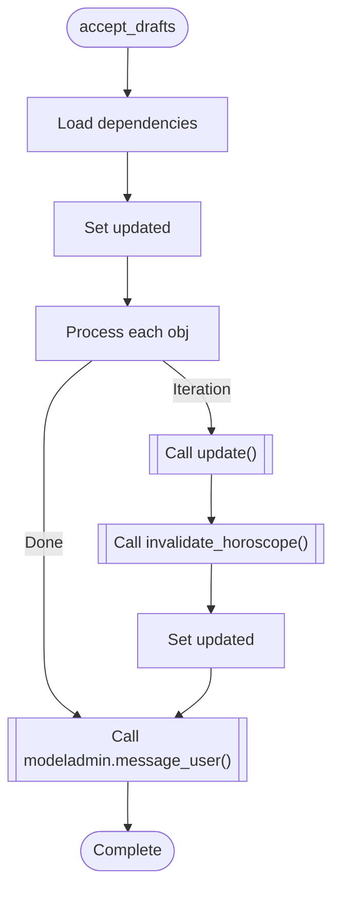

### import\_content\_view

`function` · `python` · `generic` · [`content/admin.py:214`](../content/admin.py#L214)

```mermaid
flowchart TD
  mflow_ae401e4c7f5ca2de_n1(["import_content_view"])
  mflow_ae401e4c7f5ca2de_n2["Set context"]
  mflow_ae401e4c7f5ca2de_n3[["Call _cleanup_tmp()"]]
  mflow_ae401e4c7f5ca2de_n4{"request.method == 'POST'"}
  mflow_ae401e4c7f5ca2de_n5[["Call request.POST.get()"]]
  mflow_ae401e4c7f5ca2de_n6[["Call request.POST.get()"]]
  mflow_ae401e4c7f5ca2de_n7{"action == 'preview' and request.FILES.get('file')"}
  mflow_ae401e4c7f5ca2de_n8["Set upload"]
  mflow_ae401e4c7f5ca2de_n9[["Call _format_from_path()"]]
  mflow_ae401e4c7f5ca2de_n10{"fmt is None"}
  mflow_ae401e4c7f5ca2de_n11["Set context['error']"]
  mflow_ae401e4c7f5ca2de_n12[["Call _save_tmp_file()"]]
  mflow_ae401e4c7f5ca2de_n13{"Operation succeeds?"}
  mflow_ae401e4c7f5ca2de_n14[["Call open()"]]
  mflow_ae401e4c7f5ca2de_n15[["Call importer.preview_rows()"]]
  mflow_ae401e4c7f5ca2de_n16[["Call importer.preview_summary()"]]
  mflow_ae401e4c7f5ca2de_n17[["Call os.path.basename()"]]
  mflow_ae401e4c7f5ca2de_n18["Set context['file_path']"]
  mflow_ae401e4c7f5ca2de_n19["Set context['fmt']"]
  mflow_ae401e4c7f5ca2de_n20{"not importer.has_valid_records()"}
  mflow_ae401e4c7f5ca2de_n21["Set context['error']"]
  mflow_ae401e4c7f5ca2de_n22[["Call str()"]]
  mflow_ae401e4c7f5ca2de_n23[["Call os.remove()"]]
  mflow_ae401e4c7f5ca2de_n24{"action == 'confirm' and file_path and os.path.exists(file_path)"}
  mflow_ae401e4c7f5ca2de_n25[["Call _format_from_path()"]]
  mflow_ae401e4c7f5ca2de_n26["Set mark_draft"]
  mflow_ae401e4c7f5ca2de_n27[["Call open()"]]
  mflow_ae401e4c7f5ca2de_n28[["Call importer.commit()"]]
  mflow_ae401e4c7f5ca2de_n29[["Call ContentImporter.save_log()"]]
  mflow_ae401e4c7f5ca2de_n30[["Call os.remove()"]]
  mflow_ae401e4c7f5ca2de_n31[["Call messages.success()"]]
  mflow_ae401e4c7f5ca2de_n32["Process each err"]
  mflow_ae401e4c7f5ca2de_n33[["Call messages.warning()"]]
  mflow_ae401e4c7f5ca2de_n34[["Call HttpResponseRedirect()"]]
  mflow_ae401e4c7f5ca2de_n35(["Return HttpResponseRedirect(reverse('admin:content_import'))"])
  mflow_ae401e4c7f5ca2de_n36[["Call render()"]]
  mflow_ae401e4c7f5ca2de_n37(["Return render(request, 'admin/content/import.html', context)"])
  mflow_ae401e4c7f5ca2de_n1 --> mflow_ae401e4c7f5ca2de_n2
  mflow_ae401e4c7f5ca2de_n2 --> mflow_ae401e4c7f5ca2de_n3
  mflow_ae401e4c7f5ca2de_n3 --> mflow_ae401e4c7f5ca2de_n4
  mflow_ae401e4c7f5ca2de_n4 -->|"Yes"| mflow_ae401e4c7f5ca2de_n5
  mflow_ae401e4c7f5ca2de_n5 --> mflow_ae401e4c7f5ca2de_n6
  mflow_ae401e4c7f5ca2de_n6 --> mflow_ae401e4c7f5ca2de_n7
  mflow_ae401e4c7f5ca2de_n7 -->|"Yes"| mflow_ae401e4c7f5ca2de_n8
  mflow_ae401e4c7f5ca2de_n8 --> mflow_ae401e4c7f5ca2de_n9
  mflow_ae401e4c7f5ca2de_n9 --> mflow_ae401e4c7f5ca2de_n10
  mflow_ae401e4c7f5ca2de_n10 -->|"Yes"| mflow_ae401e4c7f5ca2de_n11
  mflow_ae401e4c7f5ca2de_n10 -->|"No"| mflow_ae401e4c7f5ca2de_n12
  mflow_ae401e4c7f5ca2de_n12 --> mflow_ae401e4c7f5ca2de_n13
  mflow_ae401e4c7f5ca2de_n13 -->|"Success"| mflow_ae401e4c7f5ca2de_n14
  mflow_ae401e4c7f5ca2de_n14 --> mflow_ae401e4c7f5ca2de_n15
  mflow_ae401e4c7f5ca2de_n15 --> mflow_ae401e4c7f5ca2de_n16
  mflow_ae401e4c7f5ca2de_n16 --> mflow_ae401e4c7f5ca2de_n17
  mflow_ae401e4c7f5ca2de_n17 --> mflow_ae401e4c7f5ca2de_n18
  mflow_ae401e4c7f5ca2de_n18 --> mflow_ae401e4c7f5ca2de_n19
  mflow_ae401e4c7f5ca2de_n19 --> mflow_ae401e4c7f5ca2de_n20
  mflow_ae401e4c7f5ca2de_n20 -->|"Yes"| mflow_ae401e4c7f5ca2de_n21
  mflow_ae401e4c7f5ca2de_n13 -->|"ImportParseError"| mflow_ae401e4c7f5ca2de_n22
  mflow_ae401e4c7f5ca2de_n22 --> mflow_ae401e4c7f5ca2de_n23
  mflow_ae401e4c7f5ca2de_n7 -->|"No"| mflow_ae401e4c7f5ca2de_n24
  mflow_ae401e4c7f5ca2de_n24 -->|"Yes"| mflow_ae401e4c7f5ca2de_n25
  mflow_ae401e4c7f5ca2de_n25 --> mflow_ae401e4c7f5ca2de_n26
  mflow_ae401e4c7f5ca2de_n26 --> mflow_ae401e4c7f5ca2de_n27
  mflow_ae401e4c7f5ca2de_n27 --> mflow_ae401e4c7f5ca2de_n28
  mflow_ae401e4c7f5ca2de_n28 --> mflow_ae401e4c7f5ca2de_n29
  mflow_ae401e4c7f5ca2de_n29 --> mflow_ae401e4c7f5ca2de_n30
  mflow_ae401e4c7f5ca2de_n30 --> mflow_ae401e4c7f5ca2de_n31
  mflow_ae401e4c7f5ca2de_n31 --> mflow_ae401e4c7f5ca2de_n32
  mflow_ae401e4c7f5ca2de_n32 -->|"Iteration"| mflow_ae401e4c7f5ca2de_n33
  mflow_ae401e4c7f5ca2de_n32 -->|"Done"| mflow_ae401e4c7f5ca2de_n34
  mflow_ae401e4c7f5ca2de_n33 --> mflow_ae401e4c7f5ca2de_n34
  mflow_ae401e4c7f5ca2de_n34 --> mflow_ae401e4c7f5ca2de_n35
  mflow_ae401e4c7f5ca2de_n11 --> mflow_ae401e4c7f5ca2de_n36
  mflow_ae401e4c7f5ca2de_n21 --> mflow_ae401e4c7f5ca2de_n36
  mflow_ae401e4c7f5ca2de_n20 -->|"No"| mflow_ae401e4c7f5ca2de_n36
  mflow_ae401e4c7f5ca2de_n23 --> mflow_ae401e4c7f5ca2de_n36
  mflow_ae401e4c7f5ca2de_n24 -->|"No"| mflow_ae401e4c7f5ca2de_n36
  mflow_ae401e4c7f5ca2de_n4 -->|"No"| mflow_ae401e4c7f5ca2de_n36
  mflow_ae401e4c7f5ca2de_n36 --> mflow_ae401e4c7f5ca2de_n37
```

### make\_active

`function` · `python` · `generic` · [`content/admin.py:43`](../content/admin.py#L43)

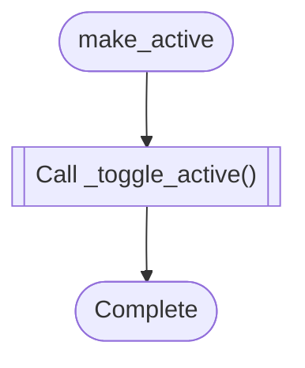

### make\_inactive

`function` · `python` · `generic` · [`content/admin.py:48`](../content/admin.py#L48)

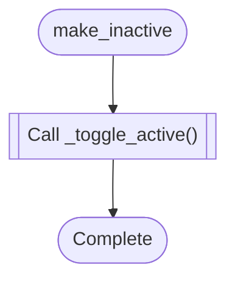

### return\_to\_draft

`function` · `python` · `generic` · [`content/admin.py:105`](../content/admin.py#L105)

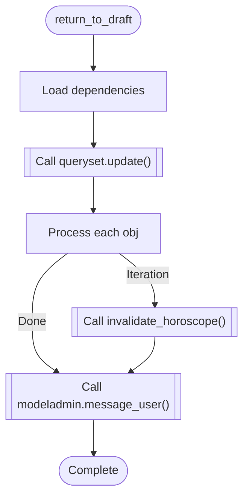

### shuffle\_facts\_action

`function` · `python` · `generic` · [`content/admin.py:57`](../content/admin.py#L57)

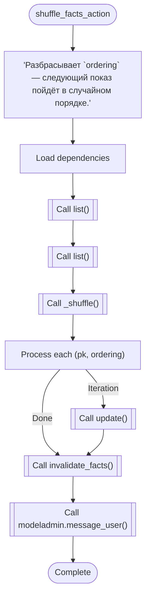

### shuffle\_horooscopes\_action

`function` · `python` · `generic` · [`content/admin.py:71`](../content/admin.py#L71)

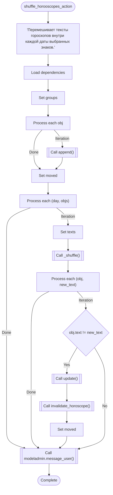

### build\_daily\_payload

`function` · `python` · `generic` · [`content/api.py:37`](../content/api.py#L37)

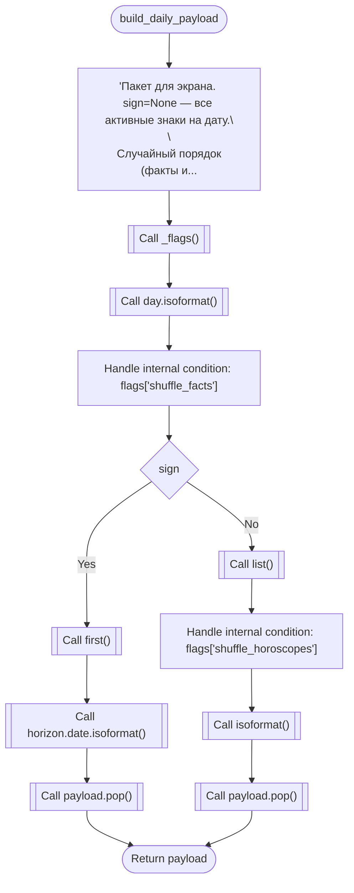

### get\_daily\_payload

`function` · `python` · `generic` · [`content/api.py:85`](../content/api.py#L85)

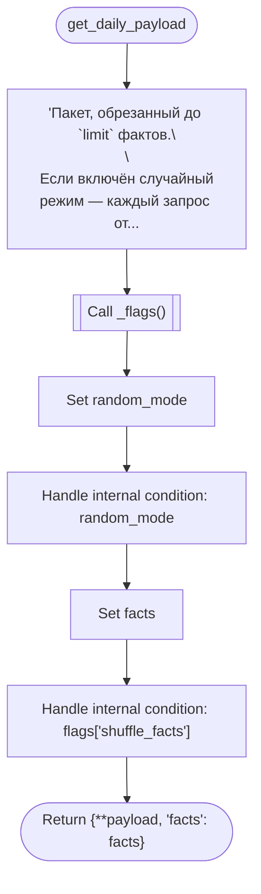

### get\_etag

`function` · `python` · `generic` · [`content/api.py:112`](../content/api.py#L112)

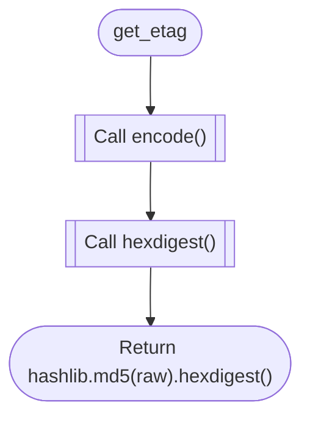

### invalidate\_facts

`function` · `python` · `generic` · [`content/api.py:122`](../content/api.py#L122)

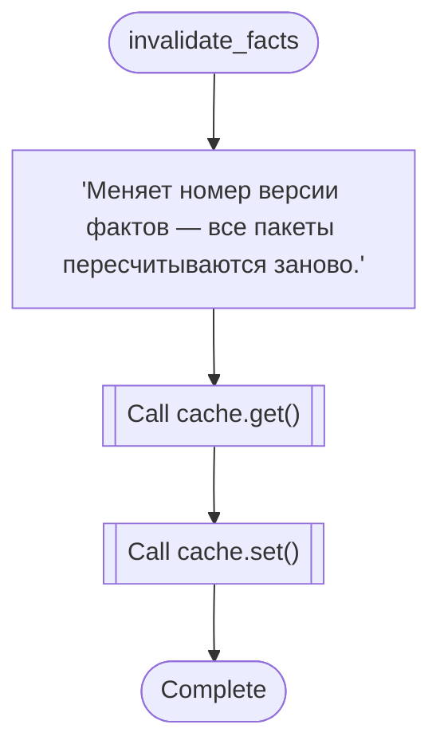

### invalidate\_horoscope

`function` · `python` · `generic` · [`content/api.py:117`](../content/api.py#L117)

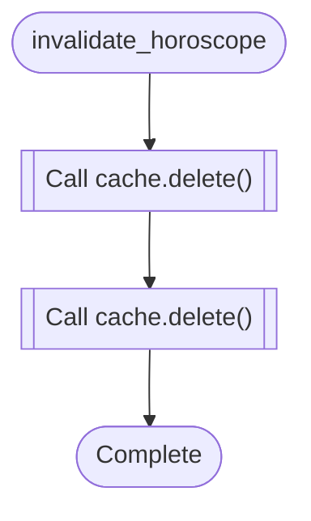

### invalidate\_settings

`function` · `python` · `generic` · [`content/api.py:128`](../content/api.py#L128)

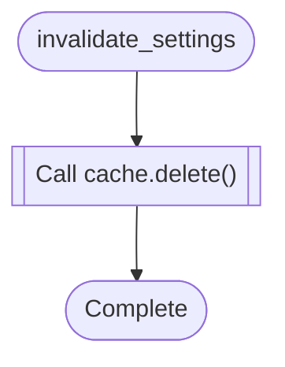

### normalize\_sign

`function` · `python` · `generic` · [`content/models.py:48`](../content/models.py#L48)

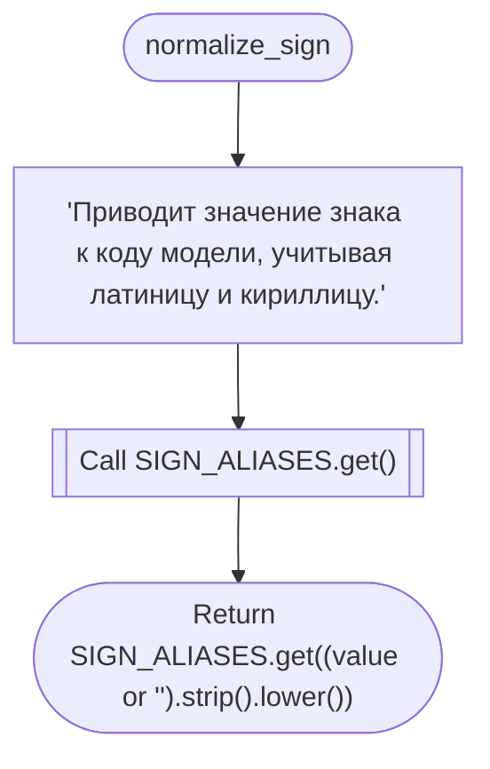

### parse\_content

`function` · `python` · `generic` · [`content/services.py:64`](../content/services.py#L64)

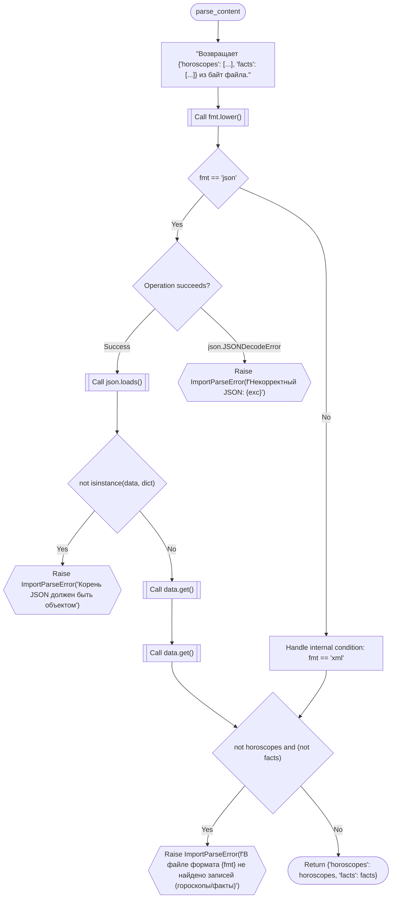

### validate\_fact

`function` · `python` · `generic` · [`content/services.py:50`](../content/services.py#L50)

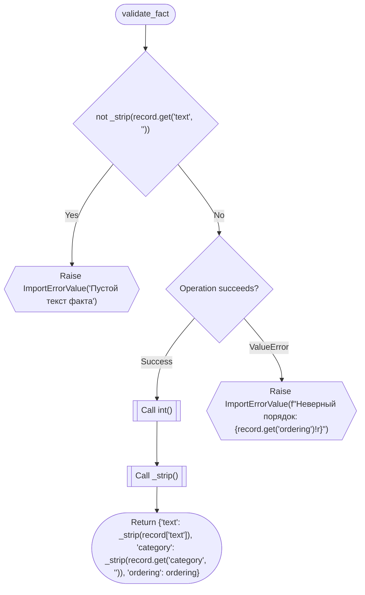

### validate\_horoscope

`function` · `python` · `generic` · [`content/services.py:30`](../content/services.py#L30)

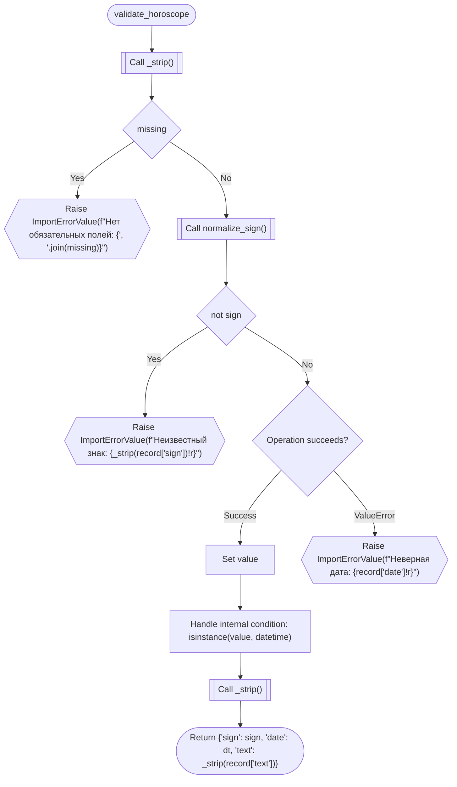

### on\_fact\_change

`event_handler` · `python` · `generic` · [`content/signals.py:16`](../content/signals.py#L16)

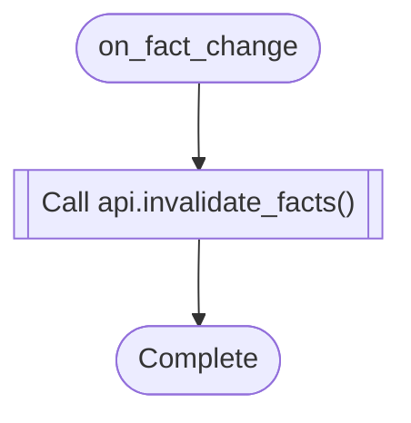

### on\_horoscope\_change

`event_handler` · `python` · `generic` · [`content/signals.py:11`](../content/signals.py#L11)

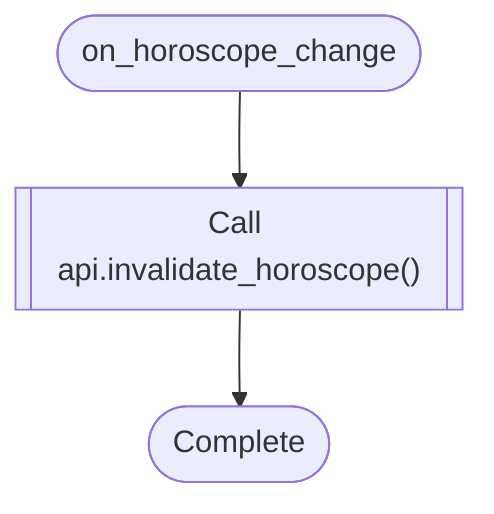

### on\_settings\_change

`event_handler` · `python` · `generic` · [`content/signals.py:21`](../content/signals.py#L21)

```mermaid
flowchart TD
  mflow_084982573a5c7fd6_n1(["on_settings_change"])
  mflow_084982573a5c7fd6_n2[["Call api.invalidate_settings()"]]
  mflow_084982573a5c7fd6_n3(["Complete"])
  mflow_084982573a5c7fd6_n1 --> mflow_084982573a5c7fd6_n2
  mflow_084982573a5c7fd6_n2 --> mflow_084982573a5c7fd6_n3
```

### main

`function` · `python` · `generic` · [`manage.py:7`](../manage.py#L7)

```mermaid
flowchart TD
  mflow_1ea0dbef7ece122b_n1(["main"])
  mflow_1ea0dbef7ece122b_n2["'Run administrative tasks.'"]
  mflow_1ea0dbef7ece122b_n3[["Call os.environ.setdefault()"]]
  mflow_1ea0dbef7ece122b_n4{"Operation succeeds?"}
  mflow_1ea0dbef7ece122b_n5["Load dependencies"]
  mflow_1ea0dbef7ece122b_n6{{"Raise ImportError(&quot;Couldn't import Django. Are you sure it's installed and available on your PYTHONPATH environment var..."}}
  mflow_1ea0dbef7ece122b_n7[["Call execute_from_command_line()"]]
  mflow_1ea0dbef7ece122b_n8(["Complete"])
  mflow_1ea0dbef7ece122b_n1 --> mflow_1ea0dbef7ece122b_n2
  mflow_1ea0dbef7ece122b_n2 --> mflow_1ea0dbef7ece122b_n3
  mflow_1ea0dbef7ece122b_n3 --> mflow_1ea0dbef7ece122b_n4
  mflow_1ea0dbef7ece122b_n4 -->|"Success"| mflow_1ea0dbef7ece122b_n5
  mflow_1ea0dbef7ece122b_n4 -->|"ImportError"| mflow_1ea0dbef7ece122b_n6
  mflow_1ea0dbef7ece122b_n5 --> mflow_1ea0dbef7ece122b_n7
  mflow_1ea0dbef7ece122b_n7 --> mflow_1ea0dbef7ece122b_n8
```


## Referenced Subflows

### \_cleanup\_tmp

`function` · `python` · `generic` · [`content/admin.py:202`](../content/admin.py#L202)

```mermaid
flowchart TD
  mflow_32bdfc48cdcdb084_n1(["_cleanup_tmp"])
  mflow_32bdfc48cdcdb084_n2{"not os.path.isdir(IMPORT_TMP_ROOT)"}
  mflow_32bdfc48cdcdb084_n3(["Return"])
  mflow_32bdfc48cdcdb084_n4["Process each name"]
  mflow_32bdfc48cdcdb084_n5[["Call os.path.join()"]]
  mflow_32bdfc48cdcdb084_n6{"Operation succeeds?"}
  mflow_32bdfc48cdcdb084_n7["Handle internal condition: timezone.now().timestamp() - os.path.getmtime(path) &gt; 3600"]
  mflow_32bdfc48cdcdb084_n8["pass"]
  mflow_32bdfc48cdcdb084_n9(["Complete"])
  mflow_32bdfc48cdcdb084_n1 --> mflow_32bdfc48cdcdb084_n2
  mflow_32bdfc48cdcdb084_n2 -->|"Yes"| mflow_32bdfc48cdcdb084_n3
  mflow_32bdfc48cdcdb084_n2 -->|"No"| mflow_32bdfc48cdcdb084_n4
  mflow_32bdfc48cdcdb084_n4 -->|"Iteration"| mflow_32bdfc48cdcdb084_n5
  mflow_32bdfc48cdcdb084_n5 --> mflow_32bdfc48cdcdb084_n6
  mflow_32bdfc48cdcdb084_n6 -->|"Success"| mflow_32bdfc48cdcdb084_n7
  mflow_32bdfc48cdcdb084_n6 -->|"OSError"| mflow_32bdfc48cdcdb084_n8
  mflow_32bdfc48cdcdb084_n4 -->|"Done"| mflow_32bdfc48cdcdb084_n9
  mflow_32bdfc48cdcdb084_n7 --> mflow_32bdfc48cdcdb084_n9
  mflow_32bdfc48cdcdb084_n8 --> mflow_32bdfc48cdcdb084_n9
```

### \_format\_from\_path

`function` · `python` · `generic` · [`content/admin.py:196`](../content/admin.py#L196)

```mermaid
flowchart TD
  mflow_4d72383d2bc44aba_n1(["_format_from_path"])
  mflow_4d72383d2bc44aba_n2[["Call get()"]]
  mflow_4d72383d2bc44aba_n3(["Return {'xml': 'xml', 'json': 'json', 'xlsx': 'xlsx', 'csv': 'csv'}.get(os.path.splitext(path)[1].strip('.').lower())"])
  mflow_4d72383d2bc44aba_n1 --> mflow_4d72383d2bc44aba_n2
  mflow_4d72383d2bc44aba_n2 --> mflow_4d72383d2bc44aba_n3
```

### \_save\_tmp\_file

`function` · `python` · `generic` · [`content/admin.py:185`](../content/admin.py#L185)

```mermaid
flowchart TD
  mflow_5e2dc2b57180f5ed_n1(["_save_tmp_file"])
  mflow_5e2dc2b57180f5ed_n2[["Call os.makedirs()"]]
  mflow_5e2dc2b57180f5ed_n3[["Call os.path.splitext()"]]
  mflow_5e2dc2b57180f5ed_n4[["Call uuid.uuid4()"]]
  mflow_5e2dc2b57180f5ed_n5[["Call os.path.join()"]]
  mflow_5e2dc2b57180f5ed_n6[["Call fh.write()"]]
  mflow_5e2dc2b57180f5ed_n7(["Return path"])
  mflow_5e2dc2b57180f5ed_n1 --> mflow_5e2dc2b57180f5ed_n2
  mflow_5e2dc2b57180f5ed_n2 --> mflow_5e2dc2b57180f5ed_n3
  mflow_5e2dc2b57180f5ed_n3 --> mflow_5e2dc2b57180f5ed_n4
  mflow_5e2dc2b57180f5ed_n4 --> mflow_5e2dc2b57180f5ed_n5
  mflow_5e2dc2b57180f5ed_n5 --> mflow_5e2dc2b57180f5ed_n6
  mflow_5e2dc2b57180f5ed_n6 --> mflow_5e2dc2b57180f5ed_n7
```

### \_shuffle

`function` · `python` · `generic` · [`content/admin.py:52`](../content/admin.py#L52)

```mermaid
flowchart TD
  mflow_2bac30ad26f3c90a_n1(["_shuffle"])
  mflow_2bac30ad26f3c90a_n2[["Call random.shuffle()"]]
  mflow_2bac30ad26f3c90a_n3(["Complete"])
  mflow_2bac30ad26f3c90a_n1 --> mflow_2bac30ad26f3c90a_n2
  mflow_2bac30ad26f3c90a_n2 --> mflow_2bac30ad26f3c90a_n3
```

### \_toggle\_active

`function` · `python` · `generic` · [`content/admin.py:27`](../content/admin.py#L27)

```mermaid
flowchart TD
  mflow_a39103ce0f12db0a_n1(["_toggle_active"])
  mflow_a39103ce0f12db0a_n2{"queryset.model is Horoscope"}
  mflow_a39103ce0f12db0a_n3["Load dependencies"]
  mflow_a39103ce0f12db0a_n4["Process each obj"]
  mflow_a39103ce0f12db0a_n5[["Call invalidate_horoscope()"]]
  mflow_a39103ce0f12db0a_n6{"queryset.model is Fact"}
  mflow_a39103ce0f12db0a_n7["Load dependencies"]
  mflow_a39103ce0f12db0a_n8[["Call invalidate_facts()"]]
  mflow_a39103ce0f12db0a_n9[["Call queryset.update()"]]
  mflow_a39103ce0f12db0a_n10["Set state"]
  mflow_a39103ce0f12db0a_n11[["Call modeladmin.message_user()"]]
  mflow_a39103ce0f12db0a_n12(["Complete"])
  mflow_a39103ce0f12db0a_n1 --> mflow_a39103ce0f12db0a_n2
  mflow_a39103ce0f12db0a_n2 -->|"Yes"| mflow_a39103ce0f12db0a_n3
  mflow_a39103ce0f12db0a_n3 --> mflow_a39103ce0f12db0a_n4
  mflow_a39103ce0f12db0a_n4 -->|"Iteration"| mflow_a39103ce0f12db0a_n5
  mflow_a39103ce0f12db0a_n2 -->|"No"| mflow_a39103ce0f12db0a_n6
  mflow_a39103ce0f12db0a_n6 -->|"Yes"| mflow_a39103ce0f12db0a_n7
  mflow_a39103ce0f12db0a_n7 --> mflow_a39103ce0f12db0a_n8
  mflow_a39103ce0f12db0a_n4 -->|"Done"| mflow_a39103ce0f12db0a_n9
  mflow_a39103ce0f12db0a_n5 --> mflow_a39103ce0f12db0a_n9
  mflow_a39103ce0f12db0a_n8 --> mflow_a39103ce0f12db0a_n9
  mflow_a39103ce0f12db0a_n6 -->|"No"| mflow_a39103ce0f12db0a_n9
  mflow_a39103ce0f12db0a_n9 --> mflow_a39103ce0f12db0a_n10
  mflow_a39103ce0f12db0a_n10 --> mflow_a39103ce0f12db0a_n11
  mflow_a39103ce0f12db0a_n11 --> mflow_a39103ce0f12db0a_n12
```

### \_facts\_version

`function` · `python` · `generic` · [`content/api.py:19`](../content/api.py#L19)

```mermaid
flowchart TD
  mflow_5e4e19914b2783a8_n1(["_facts_version"])
  mflow_5e4e19914b2783a8_n2[["Call cache.get()"]]
  mflow_5e4e19914b2783a8_n3(["Return cache.get('api:facts_version', 1)"])
  mflow_5e4e19914b2783a8_n1 --> mflow_5e4e19914b2783a8_n2
  mflow_5e4e19914b2783a8_n2 --> mflow_5e4e19914b2783a8_n3
```

### \_flags

`function` · `python` · `generic` · [`content/api.py:28`](../content/api.py#L28)

```mermaid
flowchart TD
  mflow_295dbf8f1dca2d4b_n1(["_flags"])
  mflow_295dbf8f1dca2d4b_n2[["Call cache.get()"]]
  mflow_295dbf8f1dca2d4b_n3{"flags is None"}
  mflow_295dbf8f1dca2d4b_n4[["Call SiteSettings.load()"]]
  mflow_295dbf8f1dca2d4b_n5["Set flags"]
  mflow_295dbf8f1dca2d4b_n6[["Call cache.set()"]]
  mflow_295dbf8f1dca2d4b_n7(["Return flags"])
  mflow_295dbf8f1dca2d4b_n1 --> mflow_295dbf8f1dca2d4b_n2
  mflow_295dbf8f1dca2d4b_n2 --> mflow_295dbf8f1dca2d4b_n3
  mflow_295dbf8f1dca2d4b_n3 -->|"Yes"| mflow_295dbf8f1dca2d4b_n4
  mflow_295dbf8f1dca2d4b_n4 --> mflow_295dbf8f1dca2d4b_n5
  mflow_295dbf8f1dca2d4b_n5 --> mflow_295dbf8f1dca2d4b_n6
  mflow_295dbf8f1dca2d4b_n6 --> mflow_295dbf8f1dca2d4b_n7
  mflow_295dbf8f1dca2d4b_n3 -->|"No"| mflow_295dbf8f1dca2d4b_n7
```

### \_payload\_key

`function` · `python` · `generic` · [`content/api.py:23`](../content/api.py#L23)

```mermaid
flowchart TD
  mflow_22a3e51c6891ef48_n1(["_payload_key"])
  mflow_22a3e51c6891ef48_n2[["Call hasattr()"]]
  mflow_22a3e51c6891ef48_n3[["Call _facts_version()"]]
  mflow_22a3e51c6891ef48_n4(["Return f&quot;api:today:{CACHE_VERSION}:v{_facts_version()}:{sign or 'all'}:{day_str}&quot;"])
  mflow_22a3e51c6891ef48_n1 --> mflow_22a3e51c6891ef48_n2
  mflow_22a3e51c6891ef48_n2 --> mflow_22a3e51c6891ef48_n3
  mflow_22a3e51c6891ef48_n3 --> mflow_22a3e51c6891ef48_n4
```

### \_month\_days

`function` · `python` · `generic` · [`content/management/commands/make_template.py:44`](../content/management/commands/make_template.py#L44)

```mermaid
flowchart TD
  mflow_f5baaa2a94845006_n1(["_month_days"])
  mflow_f5baaa2a94845006_n2[["Call monthrange()"]]
  mflow_f5baaa2a94845006_n3(["Return monthrange(year, month)[1]"])
  mflow_f5baaa2a94845006_n1 --> mflow_f5baaa2a94845006_n2
  mflow_f5baaa2a94845006_n2 --> mflow_f5baaa2a94845006_n3
```

### SiteSettings.load

`method` · `python` · `generic` · [`content/models.py:113`](../content/models.py#L113)

```mermaid
flowchart TD
  mflow_cdea1add6f4449c5_n1(["SiteSettings.load"])
  mflow_cdea1add6f4449c5_n2[["Call cls.objects.get_or_create()"]]
  mflow_cdea1add6f4449c5_n3(["Return obj"])
  mflow_cdea1add6f4449c5_n1 --> mflow_cdea1add6f4449c5_n2
  mflow_cdea1add6f4449c5_n2 --> mflow_cdea1add6f4449c5_n3
```

### ContentImporter.\_diff\_fact

`method` · `python` · `generic` · [`content/services.py:369`](../content/services.py#L369)

```mermaid
flowchart TD
  mflow_23987c0db2021f7f_n1(["ContentImporter._diff_fact"])
  mflow_23987c0db2021f7f_n2{"Fact.objects.filter(text=rec['text']).exists()"}
  mflow_23987c0db2021f7f_n3(["Return {'kind': 'fact', 'key': rec['text'][:45], 'status': 'unchanged'}"])
  mflow_23987c0db2021f7f_n4(["Return {'kind': 'fact', 'key': rec['text'][:45], 'status': 'add'}"])
  mflow_23987c0db2021f7f_n1 --> mflow_23987c0db2021f7f_n2
  mflow_23987c0db2021f7f_n2 -->|"Yes"| mflow_23987c0db2021f7f_n3
  mflow_23987c0db2021f7f_n2 -->|"No"| mflow_23987c0db2021f7f_n4
```

### ContentImporter.\_diff\_horoscope

`method` · `python` · `generic` · [`content/services.py:360`](../content/services.py#L360)

```mermaid
flowchart TD
  mflow_655c49ac22472055_n1(["ContentImporter._diff_horoscope"])
  mflow_655c49ac22472055_n2[["Call first()"]]
  mflow_655c49ac22472055_n3["Set key"]
  mflow_655c49ac22472055_n4{"exists is None"}
  mflow_655c49ac22472055_n5(["Return {'kind': 'horoscope', 'key': key, 'status': 'add'}"])
  mflow_655c49ac22472055_n6{"self.force_update_text and exists.text != rec['text']"}
  mflow_655c49ac22472055_n7(["Return {'kind': 'horoscope', 'key': key, 'status': 'update'}"])
  mflow_655c49ac22472055_n8(["Return {'kind': 'horoscope', 'key': key, 'status': 'unchanged'}"])
  mflow_655c49ac22472055_n1 --> mflow_655c49ac22472055_n2
  mflow_655c49ac22472055_n2 --> mflow_655c49ac22472055_n3
  mflow_655c49ac22472055_n3 --> mflow_655c49ac22472055_n4
  mflow_655c49ac22472055_n4 -->|"Yes"| mflow_655c49ac22472055_n5
  mflow_655c49ac22472055_n4 -->|"No"| mflow_655c49ac22472055_n6
  mflow_655c49ac22472055_n6 -->|"Yes"| mflow_655c49ac22472055_n7
  mflow_655c49ac22472055_n6 -->|"No"| mflow_655c49ac22472055_n8
```

### ContentImporter.\_diff\_rows

`method` · `python` · `generic` · [`content/services.py:349`](../content/services.py#L349)

```mermaid
flowchart TD
  mflow_54dfdcfdfea2ebb6_n1(["ContentImporter._diff_rows"])
  mflow_54dfdcfdfea2ebb6_n2["Set rows"]
  mflow_54dfdcfdfea2ebb6_n3["Process each rec"]
  mflow_54dfdcfdfea2ebb6_n4[["Call rows.append()"]]
  mflow_54dfdcfdfea2ebb6_n5["Process each rec"]
  mflow_54dfdcfdfea2ebb6_n6[["Call rows.append()"]]
  mflow_54dfdcfdfea2ebb6_n7(["Return rows"])
  mflow_54dfdcfdfea2ebb6_n1 --> mflow_54dfdcfdfea2ebb6_n2
  mflow_54dfdcfdfea2ebb6_n2 --> mflow_54dfdcfdfea2ebb6_n3
  mflow_54dfdcfdfea2ebb6_n3 -->|"Iteration"| mflow_54dfdcfdfea2ebb6_n4
  mflow_54dfdcfdfea2ebb6_n3 -->|"Done"| mflow_54dfdcfdfea2ebb6_n5
  mflow_54dfdcfdfea2ebb6_n4 --> mflow_54dfdcfdfea2ebb6_n5
  mflow_54dfdcfdfea2ebb6_n5 -->|"Iteration"| mflow_54dfdcfdfea2ebb6_n6
  mflow_54dfdcfdfea2ebb6_n5 -->|"Done"| mflow_54dfdcfdfea2ebb6_n7
  mflow_54dfdcfdfea2ebb6_n6 --> mflow_54dfdcfdfea2ebb6_n7
```

### ContentImporter.commit

`method` · `python` · `generic` · [`content/services.py:381`](../content/services.py#L381)

```mermaid
flowchart TD
  mflow_cd6985621ee1ad5e_n1(["ContentImporter.commit"])
  mflow_cd6985621ee1ad5e_n2[["Call ImportResult()"]]
  mflow_cd6985621ee1ad5e_n3["Set result.errors"]
  mflow_cd6985621ee1ad5e_n4["Process each rec"]
  mflow_cd6985621ee1ad5e_n5[["Call self._diff_horoscope()"]]
  mflow_cd6985621ee1ad5e_n6{"diff['status'] == 'add'"}
  mflow_cd6985621ee1ad5e_n7[["Call Horoscope.objects.create()"]]
  mflow_cd6985621ee1ad5e_n8["Set result.added"]
  mflow_cd6985621ee1ad5e_n9{"diff['status'] == 'update'"}
  mflow_cd6985621ee1ad5e_n10[["Call update()"]]
  mflow_cd6985621ee1ad5e_n11["Set result.updated"]
  mflow_cd6985621ee1ad5e_n12["Set result.unchanged"]
  mflow_cd6985621ee1ad5e_n13["Process each rec"]
  mflow_cd6985621ee1ad5e_n14{"Fact.objects.filter(text=rec['text']).exists()"}
  mflow_cd6985621ee1ad5e_n15["Set result.unchanged"]
  mflow_cd6985621ee1ad5e_n16[["Call Fact.objects.create()"]]
  mflow_cd6985621ee1ad5e_n17["Set result.added"]
  mflow_cd6985621ee1ad5e_n18[["Call len()"]]
  mflow_cd6985621ee1ad5e_n19(["Return result"])
  mflow_cd6985621ee1ad5e_n1 --> mflow_cd6985621ee1ad5e_n2
  mflow_cd6985621ee1ad5e_n2 --> mflow_cd6985621ee1ad5e_n3
  mflow_cd6985621ee1ad5e_n3 --> mflow_cd6985621ee1ad5e_n4
  mflow_cd6985621ee1ad5e_n4 -->|"Iteration"| mflow_cd6985621ee1ad5e_n5
  mflow_cd6985621ee1ad5e_n5 --> mflow_cd6985621ee1ad5e_n6
  mflow_cd6985621ee1ad5e_n6 -->|"Yes"| mflow_cd6985621ee1ad5e_n7
  mflow_cd6985621ee1ad5e_n7 --> mflow_cd6985621ee1ad5e_n8
  mflow_cd6985621ee1ad5e_n6 -->|"No"| mflow_cd6985621ee1ad5e_n9
  mflow_cd6985621ee1ad5e_n9 -->|"Yes"| mflow_cd6985621ee1ad5e_n10
  mflow_cd6985621ee1ad5e_n10 --> mflow_cd6985621ee1ad5e_n11
  mflow_cd6985621ee1ad5e_n9 -->|"No"| mflow_cd6985621ee1ad5e_n12
  mflow_cd6985621ee1ad5e_n4 -->|"Done"| mflow_cd6985621ee1ad5e_n13
  mflow_cd6985621ee1ad5e_n8 --> mflow_cd6985621ee1ad5e_n13
  mflow_cd6985621ee1ad5e_n11 --> mflow_cd6985621ee1ad5e_n13
  mflow_cd6985621ee1ad5e_n12 --> mflow_cd6985621ee1ad5e_n13
  mflow_cd6985621ee1ad5e_n13 -->|"Iteration"| mflow_cd6985621ee1ad5e_n14
  mflow_cd6985621ee1ad5e_n14 -->|"Yes"| mflow_cd6985621ee1ad5e_n15
  mflow_cd6985621ee1ad5e_n14 -->|"No"| mflow_cd6985621ee1ad5e_n16
  mflow_cd6985621ee1ad5e_n16 --> mflow_cd6985621ee1ad5e_n17
  mflow_cd6985621ee1ad5e_n13 -->|"Done"| mflow_cd6985621ee1ad5e_n18
  mflow_cd6985621ee1ad5e_n15 --> mflow_cd6985621ee1ad5e_n18
  mflow_cd6985621ee1ad5e_n17 --> mflow_cd6985621ee1ad5e_n18
  mflow_cd6985621ee1ad5e_n18 --> mflow_cd6985621ee1ad5e_n19
```

### ContentImporter.has\_valid\_records

`method` · `python` · `generic` · [`content/services.py:346`](../content/services.py#L346)

```mermaid
flowchart TD
  mflow_ac4a89d601d51503_n1(["ContentImporter.has_valid_records"])
  mflow_ac4a89d601d51503_n2[["Call bool()"]]
  mflow_ac4a89d601d51503_n3(["Return bool(self.horoscopes or self.facts)"])
  mflow_ac4a89d601d51503_n1 --> mflow_ac4a89d601d51503_n2
  mflow_ac4a89d601d51503_n2 --> mflow_ac4a89d601d51503_n3
```

### ContentImporter.preview\_rows

`method` · `python` · `generic` · [`content/services.py:374`](../content/services.py#L374)

```mermaid
flowchart TD
  mflow_3231981b617801ad_n1(["ContentImporter.preview_rows"])
  mflow_3231981b617801ad_n2[["Call self._diff_rows()"]]
  mflow_3231981b617801ad_n3(["Return self._diff_rows()"])
  mflow_3231981b617801ad_n1 --> mflow_3231981b617801ad_n2
  mflow_3231981b617801ad_n2 --> mflow_3231981b617801ad_n3
```

### ContentImporter.preview\_summary

`method` · `python` · `generic` · [`content/services.py:377`](../content/services.py#L377)

```mermaid
flowchart TD
  mflow_47351bcf7f5983e7_n1(["ContentImporter.preview_summary"])
  mflow_47351bcf7f5983e7_n2[["Call self._diff_rows()"]]
  mflow_47351bcf7f5983e7_n3[["Call sum()"]]
  mflow_47351bcf7f5983e7_n4(["Return {status: sum((1 for r in rows if r['status'] == status)) for status in ('add', 'update', 'unchanged', 'error')}"])
  mflow_47351bcf7f5983e7_n1 --> mflow_47351bcf7f5983e7_n2
  mflow_47351bcf7f5983e7_n2 --> mflow_47351bcf7f5983e7_n3
  mflow_47351bcf7f5983e7_n3 --> mflow_47351bcf7f5983e7_n4
```

### ContentImporter.save\_log

`method` · `python` · `generic` · [`content/services.py:412`](../content/services.py#L412)

```mermaid
flowchart TD
  mflow_8ce1e1915fa0f645_n1(["ContentImporter.save_log"])
  mflow_8ce1e1915fa0f645_n2["Set status"]
  mflow_8ce1e1915fa0f645_n3{"result.added or result.updated"}
  mflow_8ce1e1915fa0f645_n4["Set status"]
  mflow_8ce1e1915fa0f645_n5[["Call ImportLog.objects.create()"]]
  mflow_8ce1e1915fa0f645_n6(["Return ImportLog.objects.create(filename=filename, format=fmt.lower(), status=status, report={'added': result.added, 'u..."])
  mflow_8ce1e1915fa0f645_n1 --> mflow_8ce1e1915fa0f645_n2
  mflow_8ce1e1915fa0f645_n2 --> mflow_8ce1e1915fa0f645_n3
  mflow_8ce1e1915fa0f645_n3 -->|"Yes"| mflow_8ce1e1915fa0f645_n4
  mflow_8ce1e1915fa0f645_n4 --> mflow_8ce1e1915fa0f645_n5
  mflow_8ce1e1915fa0f645_n3 -->|"No"| mflow_8ce1e1915fa0f645_n5
  mflow_8ce1e1915fa0f645_n5 --> mflow_8ce1e1915fa0f645_n6
```

### \_combine\_text

`function` · `python` · `generic` · [`content/services.py:122`](../content/services.py#L122)

```mermaid
flowchart TD
  mflow_0f3eba1b08d87906_n1(["_combine_text"])
  mflow_0f3eba1b08d87906_n2["Set vals"]
  mflow_0f3eba1b08d87906_n3["Process each p"]
  mflow_0f3eba1b08d87906_n4{"p is None"}
  mflow_0f3eba1b08d87906_n5["Continue loop"]
  mflow_0f3eba1b08d87906_n6[["Call strip()"]]
  mflow_0f3eba1b08d87906_n7["Handle internal condition: s"]
  mflow_0f3eba1b08d87906_n8[["Call join()"]]
  mflow_0f3eba1b08d87906_n9(["Return '\\n\\n'.join(vals)"])
  mflow_0f3eba1b08d87906_n1 --> mflow_0f3eba1b08d87906_n2
  mflow_0f3eba1b08d87906_n2 --> mflow_0f3eba1b08d87906_n3
  mflow_0f3eba1b08d87906_n3 -->|"Iteration"| mflow_0f3eba1b08d87906_n4
  mflow_0f3eba1b08d87906_n4 -->|"Yes"| mflow_0f3eba1b08d87906_n5
  mflow_0f3eba1b08d87906_n4 -->|"No"| mflow_0f3eba1b08d87906_n6
  mflow_0f3eba1b08d87906_n6 --> mflow_0f3eba1b08d87906_n7
  mflow_0f3eba1b08d87906_n3 -->|"Done"| mflow_0f3eba1b08d87906_n8
  mflow_0f3eba1b08d87906_n7 --> mflow_0f3eba1b08d87906_n8
  mflow_0f3eba1b08d87906_n8 --> mflow_0f3eba1b08d87906_n9
```

### \_detect\_delimiter

`function` · `python` · `generic` · [`content/services.py:210`](../content/services.py#L210)

```mermaid
flowchart TD
  mflow_d3681c9d10abbee8_n1(["_detect_delimiter"])
  mflow_d3681c9d10abbee8_n2["Set (best, best_count)"]
  mflow_d3681c9d10abbee8_n3["Process each d"]
  mflow_d3681c9d10abbee8_n4[["Call sum()"]]
  mflow_d3681c9d10abbee8_n5["Handle internal condition: count &gt; best_count"]
  mflow_d3681c9d10abbee8_n6(["Return best"])
  mflow_d3681c9d10abbee8_n1 --> mflow_d3681c9d10abbee8_n2
  mflow_d3681c9d10abbee8_n2 --> mflow_d3681c9d10abbee8_n3
  mflow_d3681c9d10abbee8_n3 -->|"Iteration"| mflow_d3681c9d10abbee8_n4
  mflow_d3681c9d10abbee8_n4 --> mflow_d3681c9d10abbee8_n5
  mflow_d3681c9d10abbee8_n3 -->|"Done"| mflow_d3681c9d10abbee8_n6
  mflow_d3681c9d10abbee8_n5 --> mflow_d3681c9d10abbee8_n6
```

### \_norm\_col

`function` · `python` · `generic` · [`content/services.py:101`](../content/services.py#L101)

```mermaid
flowchart TD
  mflow_fe68af2138d0017a_n1(["_norm_col"])
  mflow_fe68af2138d0017a_n2[["Call lower()"]]
  mflow_fe68af2138d0017a_n3(["Return str(value or '').strip().lower()"])
  mflow_fe68af2138d0017a_n1 --> mflow_fe68af2138d0017a_n2
  mflow_fe68af2138d0017a_n2 --> mflow_fe68af2138d0017a_n3
```

### \_resolve\_columns

`function` · `python` · `generic` · [`content/services.py:105`](../content/services.py#L105)

```mermaid
flowchart TD
  mflow_6bfe64b87cdfa2f2_n1(["_resolve_columns"])
  mflow_6bfe64b87cdfa2f2_n2{"not header"}
  mflow_6bfe64b87cdfa2f2_n3(["Return {'date': None, 'sign': None, 'text': None, 'advice': None}"])
  mflow_6bfe64b87cdfa2f2_n4[["Call _norm_col()"]]
  mflow_6bfe64b87cdfa2f2_n5["Set found"]
  mflow_6bfe64b87cdfa2f2_n6["Process each (i, name)"]
  mflow_6bfe64b87cdfa2f2_n7{"found['date'] is None and name in _DATE_ALIASES"}
  mflow_6bfe64b87cdfa2f2_n8["Set found['date']"]
  mflow_6bfe64b87cdfa2f2_n9{"found['sign'] is None and name in _SIGN_ALIASES"}
  mflow_6bfe64b87cdfa2f2_n10["Set found['sign']"]
  mflow_6bfe64b87cdfa2f2_n11{"found['text'] is None and name in _TEXT_ALIASES"}
  mflow_6bfe64b87cdfa2f2_n12["Set found['text']"]
  mflow_6bfe64b87cdfa2f2_n13{"found['advice'] is None and name in _ADVICE_ALIASES"}
  mflow_6bfe64b87cdfa2f2_n14["Set found['advice']"]
  mflow_6bfe64b87cdfa2f2_n15(["Return found"])
  mflow_6bfe64b87cdfa2f2_n1 --> mflow_6bfe64b87cdfa2f2_n2
  mflow_6bfe64b87cdfa2f2_n2 -->|"Yes"| mflow_6bfe64b87cdfa2f2_n3
  mflow_6bfe64b87cdfa2f2_n2 -->|"No"| mflow_6bfe64b87cdfa2f2_n4
  mflow_6bfe64b87cdfa2f2_n4 --> mflow_6bfe64b87cdfa2f2_n5
  mflow_6bfe64b87cdfa2f2_n5 --> mflow_6bfe64b87cdfa2f2_n6
  mflow_6bfe64b87cdfa2f2_n6 -->|"Iteration"| mflow_6bfe64b87cdfa2f2_n7
  mflow_6bfe64b87cdfa2f2_n7 -->|"Yes"| mflow_6bfe64b87cdfa2f2_n8
  mflow_6bfe64b87cdfa2f2_n7 -->|"No"| mflow_6bfe64b87cdfa2f2_n9
  mflow_6bfe64b87cdfa2f2_n9 -->|"Yes"| mflow_6bfe64b87cdfa2f2_n10
  mflow_6bfe64b87cdfa2f2_n9 -->|"No"| mflow_6bfe64b87cdfa2f2_n11
  mflow_6bfe64b87cdfa2f2_n11 -->|"Yes"| mflow_6bfe64b87cdfa2f2_n12
  mflow_6bfe64b87cdfa2f2_n11 -->|"No"| mflow_6bfe64b87cdfa2f2_n13
  mflow_6bfe64b87cdfa2f2_n13 -->|"Yes"| mflow_6bfe64b87cdfa2f2_n14
  mflow_6bfe64b87cdfa2f2_n6 -->|"Done"| mflow_6bfe64b87cdfa2f2_n15
  mflow_6bfe64b87cdfa2f2_n8 --> mflow_6bfe64b87cdfa2f2_n15
  mflow_6bfe64b87cdfa2f2_n10 --> mflow_6bfe64b87cdfa2f2_n15
  mflow_6bfe64b87cdfa2f2_n12 --> mflow_6bfe64b87cdfa2f2_n15
  mflow_6bfe64b87cdfa2f2_n14 --> mflow_6bfe64b87cdfa2f2_n15
  mflow_6bfe64b87cdfa2f2_n13 -->|"No"| mflow_6bfe64b87cdfa2f2_n15
```

### \_strip

`function` · `python` · `generic` · [`content/services.py:26`](../content/services.py#L26)

```mermaid
flowchart TD
  mflow_3a607410c4ce1e28_n1(["_strip"])
  mflow_3a607410c4ce1e28_n2[["Call strip()"]]
  mflow_3a607410c4ce1e28_n3(["Return str(value or '').strip()"])
  mflow_3a607410c4ce1e28_n1 --> mflow_3a607410c4ce1e28_n2
  mflow_3a607410c4ce1e28_n2 --> mflow_3a607410c4ce1e28_n3
```

### \_table\_to\_horoscopes

`function` · `python` · `generic` · [`content/services.py:133`](../content/services.py#L133)

```mermaid
flowchart TD
  mflow_c55cc65ec02dc9bf_n1(["_table_to_horoscopes"])
  mflow_c55cc65ec02dc9bf_n2["'Разбирает таблицу в двух форматах:\\n\\n Длинный: date | sign | forecast | advice\\n Широки..."]
  mflow_c55cc65ec02dc9bf_n3["Load dependencies"]
  mflow_c55cc65ec02dc9bf_n4[["Call iter()"]]
  mflow_c55cc65ec02dc9bf_n5[["Call next()"]]
  mflow_c55cc65ec02dc9bf_n6[["Call _resolve_columns()"]]
  mflow_c55cc65ec02dc9bf_n7[["Call cols.items()"]]
  mflow_c55cc65ec02dc9bf_n8{"not missing"}
  mflow_c55cc65ec02dc9bf_n9["Set records"]
  mflow_c55cc65ec02dc9bf_n10["Process each row"]
  mflow_c55cc65ec02dc9bf_n11{"not row or not any((str(v).strip() for v in row if v is not None))"}
  mflow_c55cc65ec02dc9bf_n12["Continue loop"]
  mflow_c55cc65ec02dc9bf_n13[["Call _combine_text()"]]
  mflow_c55cc65ec02dc9bf_n14["Handle internal condition: not text"]
  mflow_c55cc65ec02dc9bf_n15[["Call records.append()"]]
  mflow_c55cc65ec02dc9bf_n16{"records"}
  mflow_c55cc65ec02dc9bf_n17(["Return records"])
  mflow_c55cc65ec02dc9bf_n18["Set date_cols"]
  mflow_c55cc65ec02dc9bf_n19["Handle internal condition: header"]
  mflow_c55cc65ec02dc9bf_n20{"not date_cols"}
  mflow_c55cc65ec02dc9bf_n21{{"Raise ImportParseError(f'Шапка таблицы должна содержать колонки: date/дата, sign/знак, forecast/текст (опц. advice/сове..."}}
  mflow_c55cc65ec02dc9bf_n22[["Call cols.get()"]]
  mflow_c55cc65ec02dc9bf_n23["Set records"]
  mflow_c55cc65ec02dc9bf_n24["Process each row"]
  mflow_c55cc65ec02dc9bf_n25{"not row or not any((str(v).strip() for v in row if v is not None))"}
  mflow_c55cc65ec02dc9bf_n26["Continue loop"]
  mflow_c55cc65ec02dc9bf_n27["Set sign_val"]
  mflow_c55cc65ec02dc9bf_n28["Handle internal condition: not str(sign_val or '').strip()"]
  mflow_c55cc65ec02dc9bf_n29["Process each (col_i, dt)"]
  mflow_c55cc65ec02dc9bf_n30["Handle internal condition: col_i &gt;= len(row)"]
  mflow_c55cc65ec02dc9bf_n31[["Call strip()"]]
  mflow_c55cc65ec02dc9bf_n32["Handle internal condition: text"]
  mflow_c55cc65ec02dc9bf_n33{"not records"}
  mflow_c55cc65ec02dc9bf_n34{{"Raise ImportParseError(f'Таблица {source_name} не содержит строк с данными')"}}
  mflow_c55cc65ec02dc9bf_n35(["Return records"])
  mflow_c55cc65ec02dc9bf_n1 --> mflow_c55cc65ec02dc9bf_n2
  mflow_c55cc65ec02dc9bf_n2 --> mflow_c55cc65ec02dc9bf_n3
  mflow_c55cc65ec02dc9bf_n3 --> mflow_c55cc65ec02dc9bf_n4
  mflow_c55cc65ec02dc9bf_n4 --> mflow_c55cc65ec02dc9bf_n5
  mflow_c55cc65ec02dc9bf_n5 --> mflow_c55cc65ec02dc9bf_n6
  mflow_c55cc65ec02dc9bf_n6 --> mflow_c55cc65ec02dc9bf_n7
  mflow_c55cc65ec02dc9bf_n7 --> mflow_c55cc65ec02dc9bf_n8
  mflow_c55cc65ec02dc9bf_n8 -->|"Yes"| mflow_c55cc65ec02dc9bf_n9
  mflow_c55cc65ec02dc9bf_n9 --> mflow_c55cc65ec02dc9bf_n10
  mflow_c55cc65ec02dc9bf_n10 -->|"Iteration"| mflow_c55cc65ec02dc9bf_n11
  mflow_c55cc65ec02dc9bf_n11 -->|"Yes"| mflow_c55cc65ec02dc9bf_n12
  mflow_c55cc65ec02dc9bf_n11 -->|"No"| mflow_c55cc65ec02dc9bf_n13
  mflow_c55cc65ec02dc9bf_n13 --> mflow_c55cc65ec02dc9bf_n14
  mflow_c55cc65ec02dc9bf_n14 --> mflow_c55cc65ec02dc9bf_n15
  mflow_c55cc65ec02dc9bf_n10 -->|"Done"| mflow_c55cc65ec02dc9bf_n16
  mflow_c55cc65ec02dc9bf_n15 --> mflow_c55cc65ec02dc9bf_n16
  mflow_c55cc65ec02dc9bf_n16 -->|"Yes"| mflow_c55cc65ec02dc9bf_n17
  mflow_c55cc65ec02dc9bf_n16 -->|"No"| mflow_c55cc65ec02dc9bf_n18
  mflow_c55cc65ec02dc9bf_n8 -->|"No"| mflow_c55cc65ec02dc9bf_n18
  mflow_c55cc65ec02dc9bf_n18 --> mflow_c55cc65ec02dc9bf_n19
  mflow_c55cc65ec02dc9bf_n19 --> mflow_c55cc65ec02dc9bf_n20
  mflow_c55cc65ec02dc9bf_n20 -->|"Yes"| mflow_c55cc65ec02dc9bf_n21
  mflow_c55cc65ec02dc9bf_n20 -->|"No"| mflow_c55cc65ec02dc9bf_n22
  mflow_c55cc65ec02dc9bf_n22 --> mflow_c55cc65ec02dc9bf_n23
  mflow_c55cc65ec02dc9bf_n23 --> mflow_c55cc65ec02dc9bf_n24
  mflow_c55cc65ec02dc9bf_n24 -->|"Iteration"| mflow_c55cc65ec02dc9bf_n25
  mflow_c55cc65ec02dc9bf_n25 -->|"Yes"| mflow_c55cc65ec02dc9bf_n26
  mflow_c55cc65ec02dc9bf_n25 -->|"No"| mflow_c55cc65ec02dc9bf_n27
  mflow_c55cc65ec02dc9bf_n27 --> mflow_c55cc65ec02dc9bf_n28
  mflow_c55cc65ec02dc9bf_n28 --> mflow_c55cc65ec02dc9bf_n29
  mflow_c55cc65ec02dc9bf_n29 -->|"Iteration"| mflow_c55cc65ec02dc9bf_n30
  mflow_c55cc65ec02dc9bf_n30 --> mflow_c55cc65ec02dc9bf_n31
  mflow_c55cc65ec02dc9bf_n31 --> mflow_c55cc65ec02dc9bf_n32
  mflow_c55cc65ec02dc9bf_n24 -->|"Done"| mflow_c55cc65ec02dc9bf_n33
  mflow_c55cc65ec02dc9bf_n29 -->|"Done"| mflow_c55cc65ec02dc9bf_n33
  mflow_c55cc65ec02dc9bf_n32 --> mflow_c55cc65ec02dc9bf_n33
  mflow_c55cc65ec02dc9bf_n33 -->|"Yes"| mflow_c55cc65ec02dc9bf_n34
  mflow_c55cc65ec02dc9bf_n33 -->|"No"| mflow_c55cc65ec02dc9bf_n35
```

### \_xlsx\_body

`function` · `python` · `generic` · [`content/tests.py:43`](../content/tests.py#L43)

```mermaid
flowchart TD
  mflow_ecca2dee34862b5e_n1(["_xlsx_body"])
  mflow_ecca2dee34862b5e_n2["'Возвращает байты .xlsx таблицы date|sign|forecast|advice для тестов.'"]
  mflow_ecca2dee34862b5e_n3["Load dependencies"]
  mflow_ecca2dee34862b5e_n4["Load dependencies"]
  mflow_ecca2dee34862b5e_n5[["Call Workbook()"]]
  mflow_ecca2dee34862b5e_n6["Set ws"]
  mflow_ecca2dee34862b5e_n7[["Call ws.append()"]]
  mflow_ecca2dee34862b5e_n8["Process each row"]
  mflow_ecca2dee34862b5e_n9[["Call ws.append()"]]
  mflow_ecca2dee34862b5e_n10[["Call BytesIO()"]]
  mflow_ecca2dee34862b5e_n11[["Call wb.save()"]]
  mflow_ecca2dee34862b5e_n12[["Call buf.getvalue()"]]
  mflow_ecca2dee34862b5e_n13(["Return buf.getvalue()"])
  mflow_ecca2dee34862b5e_n1 --> mflow_ecca2dee34862b5e_n2
  mflow_ecca2dee34862b5e_n2 --> mflow_ecca2dee34862b5e_n3
  mflow_ecca2dee34862b5e_n3 --> mflow_ecca2dee34862b5e_n4
  mflow_ecca2dee34862b5e_n4 --> mflow_ecca2dee34862b5e_n5
  mflow_ecca2dee34862b5e_n5 --> mflow_ecca2dee34862b5e_n6
  mflow_ecca2dee34862b5e_n6 --> mflow_ecca2dee34862b5e_n7
  mflow_ecca2dee34862b5e_n7 --> mflow_ecca2dee34862b5e_n8
  mflow_ecca2dee34862b5e_n8 -->|"Iteration"| mflow_ecca2dee34862b5e_n9
  mflow_ecca2dee34862b5e_n8 -->|"Done"| mflow_ecca2dee34862b5e_n10
  mflow_ecca2dee34862b5e_n9 --> mflow_ecca2dee34862b5e_n10
  mflow_ecca2dee34862b5e_n10 --> mflow_ecca2dee34862b5e_n11
  mflow_ecca2dee34862b5e_n11 --> mflow_ecca2dee34862b5e_n12
  mflow_ecca2dee34862b5e_n12 --> mflow_ecca2dee34862b5e_n13
```

### TodayAPIView.get

`method` · `python` · `generic` · [`content/views.py:59`](../content/views.py#L59)

```mermaid
flowchart TD
  mflow_3b33b1f0559613b8_n1(["TodayAPIView.get"])
  mflow_3b33b1f0559613b8_n2[["Call request.GET.get()"]]
  mflow_3b33b1f0559613b8_n3[["Call normalize_sign()"]]
  mflow_3b33b1f0559613b8_n4{"raw_sign and (not sign)"}
  mflow_3b33b1f0559613b8_n5[["Call HttpResponse()"]]
  mflow_3b33b1f0559613b8_n6(["Return HttpResponse('{&quot;error&quot;: &quot;unknown sign&quot;}', content_type='application/json', status=400)"])
  mflow_3b33b1f0559613b8_n7[["Call request.GET.get()"]]
  mflow_3b33b1f0559613b8_n8[["Call _parse_date()"]]
  mflow_3b33b1f0559613b8_n9{"day is None"}
  mflow_3b33b1f0559613b8_n10[["Call HttpResponse()"]]
  mflow_3b33b1f0559613b8_n11(["Return HttpResponse('{&quot;error&quot;: &quot;invalid date, use ISO-8601 (YYYY-MM-DD)&quot;}', content_type='application/json', status=400)"])
  mflow_3b33b1f0559613b8_n12{"Operation succeeds?"}
  mflow_3b33b1f0559613b8_n13[["Call request.GET.get()"]]
  mflow_3b33b1f0559613b8_n14["Set limit"]
  mflow_3b33b1f0559613b8_n15[["Call get_daily_payload()"]]
  mflow_3b33b1f0559613b8_n16[["Call request.GET.get()"]]
  mflow_3b33b1f0559613b8_n17[["Call get_etag()"]]
  mflow_3b33b1f0559613b8_n18[["Call request.headers.get()"]]
  mflow_3b33b1f0559613b8_n19{"if_none_match and if_none_match.strip('&quot;') == etag"}
  mflow_3b33b1f0559613b8_n20[["Call HttpResponse()"]]
  mflow_3b33b1f0559613b8_n21(["Return HttpResponse(status=304)"])
  mflow_3b33b1f0559613b8_n22["Handle internal condition: fmt == 'xml'"]
  mflow_3b33b1f0559613b8_n23["Set response['ETag']"]
  mflow_3b33b1f0559613b8_n24["Set response['Cache-Control']"]
  mflow_3b33b1f0559613b8_n25(["Return response"])
  mflow_3b33b1f0559613b8_n1 --> mflow_3b33b1f0559613b8_n2
  mflow_3b33b1f0559613b8_n2 --> mflow_3b33b1f0559613b8_n3
  mflow_3b33b1f0559613b8_n3 --> mflow_3b33b1f0559613b8_n4
  mflow_3b33b1f0559613b8_n4 -->|"Yes"| mflow_3b33b1f0559613b8_n5
  mflow_3b33b1f0559613b8_n5 --> mflow_3b33b1f0559613b8_n6
  mflow_3b33b1f0559613b8_n4 -->|"No"| mflow_3b33b1f0559613b8_n7
  mflow_3b33b1f0559613b8_n7 --> mflow_3b33b1f0559613b8_n8
  mflow_3b33b1f0559613b8_n8 --> mflow_3b33b1f0559613b8_n9
  mflow_3b33b1f0559613b8_n9 -->|"Yes"| mflow_3b33b1f0559613b8_n10
  mflow_3b33b1f0559613b8_n10 --> mflow_3b33b1f0559613b8_n11
  mflow_3b33b1f0559613b8_n9 -->|"No"| mflow_3b33b1f0559613b8_n12
  mflow_3b33b1f0559613b8_n12 -->|"Success"| mflow_3b33b1f0559613b8_n13
  mflow_3b33b1f0559613b8_n12 -->|"(TypeError, ValueError)"| mflow_3b33b1f0559613b8_n14
  mflow_3b33b1f0559613b8_n13 --> mflow_3b33b1f0559613b8_n15
  mflow_3b33b1f0559613b8_n14 --> mflow_3b33b1f0559613b8_n15
  mflow_3b33b1f0559613b8_n15 --> mflow_3b33b1f0559613b8_n16
  mflow_3b33b1f0559613b8_n16 --> mflow_3b33b1f0559613b8_n17
  mflow_3b33b1f0559613b8_n17 --> mflow_3b33b1f0559613b8_n18
  mflow_3b33b1f0559613b8_n18 --> mflow_3b33b1f0559613b8_n19
  mflow_3b33b1f0559613b8_n19 -->|"Yes"| mflow_3b33b1f0559613b8_n20
  mflow_3b33b1f0559613b8_n20 --> mflow_3b33b1f0559613b8_n21
  mflow_3b33b1f0559613b8_n19 -->|"No"| mflow_3b33b1f0559613b8_n22
  mflow_3b33b1f0559613b8_n22 --> mflow_3b33b1f0559613b8_n23
  mflow_3b33b1f0559613b8_n23 --> mflow_3b33b1f0559613b8_n24
  mflow_3b33b1f0559613b8_n24 --> mflow_3b33b1f0559613b8_n25
```

### \_parse\_date

`function` · `python` · `generic` · [`content/views.py:45`](../content/views.py#L45)

```mermaid
flowchart TD
  mflow_abad530be64e7c35_n1(["_parse_date"])
  mflow_abad530be64e7c35_n2{"Operation succeeds?"}
  mflow_abad530be64e7c35_n3[["Call date.fromisoformat()"]]
  mflow_abad530be64e7c35_n4(["Return date.fromisoformat(value)"])
  mflow_abad530be64e7c35_n5(["Return None"])
  mflow_abad530be64e7c35_n1 --> mflow_abad530be64e7c35_n2
  mflow_abad530be64e7c35_n2 -->|"Success"| mflow_abad530be64e7c35_n3
  mflow_abad530be64e7c35_n3 --> mflow_abad530be64e7c35_n4
  mflow_abad530be64e7c35_n2 -->|"(ValueError, TypeError)"| mflow_abad530be64e7c35_n5
```
